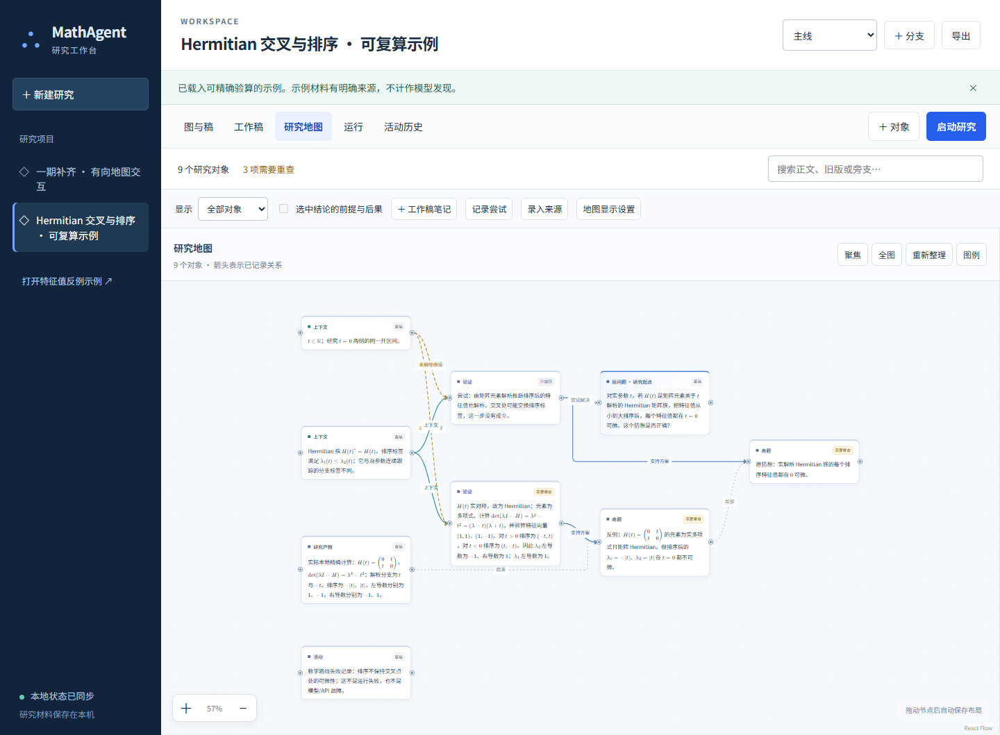

# 一期补齐与研究地图验收

日期：2026-09-08。此报告更新[补齐前蓝图审计](blueprint-audit-2026-09-08.md)，区分功能实现、工程验证和真实模型表现。

**本轮已补齐审计列出的 G01—G09 功能，并完成工程回归。研究地图和 LaTeX 展示已交付。暂不开展 IMO 摸底：真实演示的主任务收尾仍有一次协议失败，GLM 实际账户未配置，不能宣布施工方案 M3—M4 的全部真实验收通过。**

## 研究地图与公式

- 按已记录的依赖关系从左向右排列；原问题保留明显标识，无依赖的材料单独排列，不虚构连线。
- 节点有固定连接端口、明确箭头和关系标签；连线绕开无关卡片。选中节点突出相邻路径，其他路径减弱。
- 支持拖动、缩放、聚焦、全图、重新整理与图例；拖动结果自动保存，延迟保存回执和 SSE 更新不会把节点拉回旧位置。
- 隐藏、折叠、恢复与归档只改变显示状态，数学依赖保持独立。
- 数学正文使用 LaTeX；图卡片、工作稿、详情、审查、历史版本和研究步骤使用同一 Markdown/KaTeX 渲染。支持美元分隔符及圆括号/方括号形式，不截断公式字符串；代码块保留原文。
- 旧数据库里没有数学分隔符的文本不会自动猜测改写；新示例与模型提示已采用 LaTeX。调用原文面板仍显示原始 JSON，便于核对。

浏览器测试检查连线端点距端口小于 4 像素，并沿路径每 3 个 SVG 长度单位采样，确认拖动前后不穿越无关卡片内部；验证延迟保存、SSE、刷新后位置、窄屏聚焦和公式渲染。

[窄屏截图](screenshots/research-map-completion-mobile.png)。本机预览位于 `http://127.0.0.1:8002`，使用研究数据库副本，不启动模型 worker。原有端口的进程未替换；正式使用新后端需按 README 重启服务。

## 功能缺口逐项复核

| 编号 | 已实现 | 直接依据 |
| --- | --- | --- |
| G01 | 受控读取、检索、草稿/证明、失败/来源、分支、子任务、讨论、计算、独立审查；持久步骤与动作回执；最多两轮审查修订 | `test_autonomous_agent.py`、`test_agent_record_actions.py`、`test_calculation_repair.py` |
| G02 | 带采用/支持/证据状态的局部上下文，固定版本读取与跨分支围栏；正文、payload 和记录分页，压缩后保留来源、偏移和哈希 | `test_agent_context.py` 的 9 项专项；实际消息序列化长度限制覆盖 JSON 转义及格式修复 |
| G03 | 冻结实际模型、有效参数、超时、提示版本/哈希，保存调用标识和 usage | `test_provider_observability.py`、`test_provider_pipeline.py`；两轮真实调用记录 |
| G04 | 错误/截断/中断可见原文保全；一次有预算的格式修复；已保存结果恢复、不明请求不盲重试 | 提供方测试、7 项实际独立进程恢复测试；真实预算耗尽时拒绝追加修复 |
| G05 | 四类失败、精确目标/假设/证据绑定、重试条件、来源定位和访问日期；引用随导出闭包保存 | `test_research_records.py`、`test_agent_export.py` |
| G06 | 分支范围暂停/引导/停止，其他分支独立；操作许可、全树数量/深度、全部祖先共享请求上限 | `test_autonomous_agent.py`、`test_runtime_ready.py`；浏览器策略与分支控制 |
| G07 | 项目/分支/任务调额，步数或额度耗尽后恢复同一任务 | API 预算竞争测试；浏览器增额→恢复流程 |
| G08 | 有理数、多项式恒等式、Hermitian 交叉三个固定精确工具；文件原子落盘、哈希、导出冻结和备份恢复 | `test_exact_operations.py`、`test_artifact_files.py`、`test_exports_recovery.py` |
| G09 | 折叠/隐藏/恢复/归档、布局 CAS、可视依赖导航、公式一致展示 | `test_research_records.py`、浏览器功能与地图回归 |

工具只提供固定受限计算，不执行模型生成的任意代码。精确计算证据限定为实际检查范围，不自动采用目标或声称完整形式证明。文件限制为单件 512 KiB、引用集合 64 MiB/4096 件。

## A01—A12 与验证记录

| 项目 | 本轮证据与结果 |
| --- | --- |
| A01 持久化与重开 | 状态/工作台测试、浏览器刷新与新目录恢复通过 |
| A02 运行中改版本 | 离线围栏通过；第二轮真实请求在收到成功响应头后修改目标，旧结果隔离，恢复读取新版本通过 |
| A03 共同前提与替代证明 | AND/OR 支持、撤回不等于反驳通过 |
| A04 条件与循环 | 未证假设保持条件、循环不自举、普通研究关系允许环通过 |
| A05 两 worker 与人并发 | 两个实际 HTTPWorker 配合合成提供方并发，人类修改后两个迟到结果保留且不执行旧动作；未进行双付费调用的并发故障试验 |
| A06 图稿与 SSE | 实际回环 HTTP/SSE 重连、布局延迟保存、图稿联动通过；提交到图与稿都出现的实测约 1.51 秒，低于该用例的 2 秒门槛 |
| A07 分支控制 | 暂停/引导/停止、请求与生效分离、其他分支继续及迟到隔离通过 |
| A08 崩溃与未知请求 | 7 项用例实际启动并终止自有 API/worker 进程；覆盖外部受理、保存观察、结算、重复提交及旧动作隔离。外部服务为本机合成提供方 |
| A09 失败范围 | 数学未解决/错误、数值支持、人工采用与运行故障分开；工具局部证据不升级完整证明 |
| A10 审查版本 | 旧审查固定版本；独立会话输入屏蔽旧模型判断。真实审查重新展开恒等式及核对等号，见下文局限 |
| A11 额度与上限 | 并发预留、未知占用、全树/祖先上限及增额恢复通过；第二轮真实请求恰为 6 次，无结果不明请求 |
| A12 示例、导出、恢复 | 固定 Hermitian 算例、派生问题、历史版本闭包、文件校验与恢复通过；真实研究演示已留证，但主任务最终协议失败，不能标为完整真实闭环通过 |

完整 Python 回归为 **348 项通过**，耗时 206.70 秒；另有两项上游 Starlette/AnyIO 弃用提示。报告：[Python XML](python-completion-2026-09-08.xml)。随后输出契约新增 **6 项测试通过**，适配器、上下文、运行和演示相关回归 **103 项通过**（31.67 秒）；验收脚本失败时返回非零退出码的调整后，演示脚本用例也再次通过。103 项是有重叠的相关回归，不与 348 相加。

完整浏览器回归 **17 项通过**；最后一次连线绕行调整后地图专项再次通过。随后对实际提供方正文回放、跨视图公式和 Hermitian 导出的 **3 项相关测试通过**，终端耗时 14.9 秒，确认嵌套 JSON 解码后的 LaTeX 本来正确，无需改写反斜杠。证据：[完整浏览器 JSON](browser-completion-2026-09-08.json)、[地图专项状态](map-routing-last-run-2026-09-08.json)、[公式专项状态](latex-replay-last-run-2026-09-08.json)、[实际多行公式截图](screenshots/actual-provider-aligned-latex.png)。后续专项只保留状态文件与终端结果，不冒用之前的完整 JSON；这些用例有重叠，不相加作为全套数量。TypeScript/Vite 生产构建通过。

[打包验证](packaging-completion.json)校验 wheel 与当前 Python 源文件逐字节一致，并在仓库外隔离导入验证 API、迁移和契约；未联网安装依赖。wheel 不包含前端构建，分离安装需设置前端目录。

交付分支为 `codex/phase-one-completion`；[源码与证据清单](source-baseline-2026-09-08.json)记录交付文件的 SHA-256（清单自身除外）和 wheel 哈希。用户密钥、数据目录、运行日志与依赖目录不进入此基线。

## 真实调用与数学判断

本轮使用当前配置的 DeepSeek 模型，共两批 **11 次**真实请求；另有先前一次接入冒烟。研究模型未获得网页检索、外部资源下载或任意代码工具。远程模型推理本身仍需连接提供方，不能称为整个程序断网运行。

第一批 5 次：[原始报告](real-function-first-run-2026-09-08.json)。计算参数契约不够具体导致字段猜错，另有输出长度不足导致截断。已补工具分类型参数 schema、机器表达式语法及安全错误回执；第二批验收的输出上限设为 8192，未更改用户 `.env`。

第二批 6 次：[原始报告](real-function-second-run-2026-09-08.json)。10 项检查中 9 项通过：实际精确计算、证明保存、独立审查、保持草稿、在途改题隔离、恢复读新版本、请求上限、无未知请求、配置/用量保全。唯一未通过项是主研究任务完成状态：最终 JSON 的 `mode=research` 却携带审查专用 `verdict=passed`，被严格协议拒收。剩余额度不足时没有自动追加修复请求。报告保留失败，不用后续离线修复改写历史结果。

该问题已补最小修复：`research-operations-v3` 根据实际任务角色给模型更严格的输出 schema，研究的顶层 verdict 只能为空，审查的 verdict 和 scope 必填；运行时校验不放宽、不静默改写模型结论。[实际响应回放](../../tests/integration/test_real_response_replay.py)验证共享预算为 4 次时保留失败并停止，预算为 5 次时只增加一次独立格式修复，取得新响应后才完成。旧失败记录和独立审查均保留。此结果来自离线回放，新提示尚未进行第三批真实复验。

所验证的数学是：对于实数 $a,b,c$，

$$
(a+b+c)^2-3(ab+bc+ca)
=\frac{(a-b)^2+(b-c)^2+(c-a)^2}{2}\ge 0.
$$

等号成立当且仅当 $a=b=c$。证明与审查的数学内容正确；审查实际重新展开并核对非负性与等号，固定到提交的证明版本，覆盖标记仍为局部。计算器只比较了恒等式，产物未绑定证明目标，不能据此声称非负性、等号条件或整个证明已获机器验证。

这道题的平方和路线和操作顺序已写入验收指令，因此只验证工具与研究流程，不测模型自主发现能力。审查是同一模型的新会话，不是不同模型交叉验证或形式化证明。恢复后改成整数变量，检验的是版本读取与隔离；它也不能代表复杂前提变化后的研究能力。

## IMO 准入结论与剩余范围

**已有进行受控小题试验的工程基础，但本轮不启动 IMO 摸底。** 目前尚无未经路线提示的竞赛题证据，真实主任务收尾协议仍需在新提示下验证；GLM 未配置，不能将两适配器的 MockTransport 回归冒充两账户实测。

后续先用普通题验证自主选择步骤和最终收尾，并为一次格式修复预留独立额度；通过后再选少量正式 IMO 题，在只提供题面的条件下记录完整输出、预算和独立评分。应明确模型预训练可能包含公开题，禁用检索不等于排除了题目记忆。本轮没有消耗 IMO 题目或增加第三批付费请求。

M5 的完整语义合并、条件解除、旁支转项目及永久删除，M6 的隔离生成代码、形式工具、跨项目复用和文章整理仍按施工方案留在后续。GLM 账户回归、真实外部异常计费对账、长证明与大研究图的扩展性能也不在本轮通过结论内。
