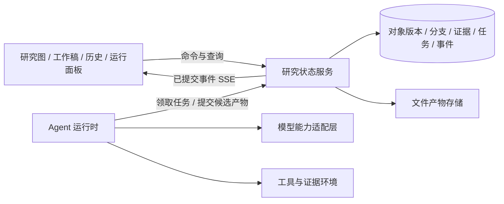

# 数学科研多 Agent 工作台施工方案 v0.1

> 历史设计，部分限制和流程已退役。当前架构见 [项目说明](../README.md)，旧验收与试测合并见 [测试历史](../docs/testing-history.md)。

编制日期：2026-09-08  
依据：[《可视化数学科研多 Agent 工作台：假想蓝图 v0.2》](../math_research_agent_blueprint_v0.2_zh.md)  
文档用途：把蓝图转化为可分批开发、演示和验收的工程任务。以下技术选型、工期和阈值是本方案的建议，不代表现有实现或实测结果。

本次增补：可选联网文献检索只进入后续待排期范围；默认关闭，闭卷评测禁用。下文初始起点与原排期保留为编制时背景，实际进度以 `docs/acceptance/` 的验收记录为准。

## 1. 施工目标与当前起点

先交付一个能够保存研究、允许人类直接干预、准确展示证据和恢复运行的本地工作台。第一版的决定性验收场景是：**Agent 正在引用引理 L 的 v1 版本工作时，用户将 L 改为 v2；系统保留 v1，标记相关论证需要重查，拦截过时结果覆盖主线，并使下一次研究明确使用 v2。**

2026-09-08 检查项目目录时，仅发现蓝图文件和空的“施工方案”目录，未发现应用源码、依赖配置、测试或 Git 仓库。因此按从零建设安排，不把任何功能列为已完成。本次交付施工文档；下文目录、接口及脚本均为待建设项。

施工原则：

1. 先做统一研究状态，再做展示和模型编排；图、工作稿和历史必须读取同一份数据。
2. 用户和 Agent 都通过可追溯的操作修改项目；用户可以直接编辑，不必经过总控 Agent。
3. 草稿只要求正文；被论证依赖、被主线采用和被正式导出时，分别承担更完整的信息要求。
4. 工程校验检查引用、版本、结构和操作权限；数学是否成立仍要看具体论证与证据。
5. 保留原问题，允许创建更强、更弱或不同假设下的衍生问题；不得悄悄替换目标后声称完成。

## 2. 分期范围

| 阶段 | 必须交付 | 本阶段完成标准 |
| --- | --- | --- |
| 第一阶段：M0—M4，最小研究闭环 | 创建问题、自由草稿、版本与基本分支、图和工作稿联动、少量工作者、按需审查、局部插话、修改影响、暂停恢复、失败记录、Markdown 导出 | 本文 A01—A12 全部通过，并用真实模型完成一次有证据记录的研究演示 |
| 第二阶段：M5，研究资产积累 | 分支差异与合并、替代证明完整交互、条件与假设解除、失败检索、来源定位、选择性重查、局部成果导出和旁支转项目 | A13—A18 全部通过，能在主问题未解决时独立复用局部成果 |
| 第三阶段：M6，工具与长项目 | 受隔离的计算执行、局部形式化、更多计算后端、跨项目检索、强模型适配、文章级整理与复核 | A19—A22 全部通过，完整交付一个小型长周期课题记录 |

替代证明、未解除假设、证据范围、版本冲突必须从第一阶段进入数据模型。第二阶段扩充操作体验和分析能力，不允许第一阶段先采用“一条边就是证明”“一个 verified 字段表示可信度”等临时语义。

早期不建设专属模型训练、海量常驻 Agent、复杂多租户、全学科自动形式化、自动投稿。第一阶段默认单用户本地使用；账户体系和多人实时编辑在出现实际需求后另行评估。

自动联网搜索和获取文献本轮不施工。手工来源录入、项目内部检索与闭卷数学评测照常推进；联网能力按第 6.5 节单独建设、授权和验收，不能将“已有来源对象”计为“已具备联网检索”。

## 3. 推荐技术路线与边界

### 3.1 默认选型

| 层次 | 建议 | 选择目的及约束 |
| --- | --- | --- |
| 前端 | React + TypeScript + Vite | 构建单页工作台；先用 Markdown 编辑与公式预览，后续再评估富文本协作 |
| 研究图 | React Flow（`@xyflow/react`） | 实现选择、折叠、定位与自定义节点；数学关系保存在后端，画布只保存布局 |
| 数学正文 | Markdown + KaTeX | 支持连续阅读和公式展示；正文引用通过稳定对象及版本锚点关联 |
| 后端 | Python + FastAPI + Pydantic | 提供命令、查询、数据校验、模型和后续数学工具接口 |
| 持久化 | SQLite + SQLAlchemy + Alembic；产物放项目数据目录 | 初期单机部署，启用外键、迁移和事务；不因画图引入图数据库 |
| 任务运行 | 一个独立 worker，持久任务表、租约与检查点 | API 与执行循环分离；任务状态不只放在内存或请求后台回调中 |
| 状态推送 | HTTP 命令 + SSE 事件流 | 命令有回执，客户端按事件序号追赶；服务端状态才是事实来源 |
| 测试 | pytest、前端交互测试、Playwright 端到端测试 | 确定性测试验证状态机制，少量真实调用验证适配器 |

React Flow 的官方入门资料提供 React/Vite 接入方式；此处据此选作画布组件，版本与数学语义仍由本项目实现。[React Flow 官方文档](https://reactflow.dev/learn)

SQLite WAL 支持读写并行，但同一时刻只有一个写入者，且不适用于网络文件系统。本方案据此限定为单机、短事务和小规模并发；出现持续写入拥塞或多机部署需求后再迁移 PostgreSQL。[SQLite WAL 官方文档](https://sqlite.org/wal.html)

FastAPI 提供生命周期资源管理和 SSE 接口；应用自行实现任务持久化、事件留存与重连补发，不能把框架支持推送理解成已经具备运行恢复。[生命周期文档](https://fastapi.tiangolo.com/advanced/events/)、[SSE 官方文档](https://fastapi.tiangolo.com/tutorial/server-sent-events/)

### 3.2 本地运行与依赖决策

按 `$maedaily-context` 的环境记录和本次只读检查，原型优先适配 Windows PowerShell。本次能定位 Python、Node 和 npm 命令，但未运行项目依赖安装或兼容性测试，不能据此宣称开发环境已就绪。M0 中核对运行时版本并锁定依赖；Python 使用项目独立环境，不改动其他项目环境。

基础工作台不依赖 WSL 或 Docker。任意模型生成代码的执行单独设置准入条件：只有受限执行环境验收通过后才能启用。此前可使用固定、经过检查的数学计算工具和模拟执行器，不能把宿主机子进程加超时当作安全沙箱。

应用默认仅监听本机，密钥仅由后端读取；本地写操作也需校验会话令牌及来源。依赖版本在 M0 锁文件中确定；真实模型 ID、账户权限和计费规则在适配阶段按官方接口实测，不在本方案中宣称已经可用。

### 3.3 模块关系



运行时不绕过状态服务直接改数据库或主线文件。API 服务通过 lifespan 管理连接等资源；worker 独立启动，避免 API 热重载重复创建调度器。初期不引入 Redis、分布式消息队列或复杂编排框架。

## 4. 数据模型：先固定不可返工的语义

### 4.1 核心实体

以下为逻辑模型，不要求每行对应一张独立表；关键引用、唯一约束和索引不能全部藏在无约束 JSON 中。

| 实体 | 核心字段 | 不变量 |
| --- | --- | --- |
| `Project` | `id, original_goal_id, policies, budget` | 原始目标稳定保存；研究自由度、资源与操作权限、结果采用策略独立配置 |
| `ResearchObject` | `id, project_id, kind, created_by` | 六类基础对象：问题、上下文、命题、论证、研究产物、活动记录；子类型可扩展 |
| `ObjectRevision` | `id, object_id, parent_revision_ids, body, payload, author, created_at` | 数学正文和结构不可原地覆盖；合并可以有多个父版本 |
| `Branch / BranchHead` | `branch_id, object_id, revision_id, branch_seq, control_epoch` | 分支记录当前选定的对象版本，不等同于正式采用；布局变化不改变数学正文 |
| `Context` | 定义、假设、符号、参数范围、定义域、常数依赖及其版本引用 | 同名符号不自动判定同义；冲突必须可见 |
| `ProofPlan` | 结论版本、上下文版本、共同前提、论证正文、缺口、未解除假设 | 一个命题可以有多个方案；一个方案内的前提共同需要 |
| `Dependency` | 来源版本、目标论证版本、用途、局部作用域、提取来源 | 来源区分作者声明、模型推断和形式工具提取；不能省略适用范围 |
| `ResearchRelation` | 起终对象、关系类型、来源 | 启发、尝试解决、反驳、改写、相似等关系不参与证明 DAG 校验 |
| `Review / Evidence` | 目标版本、上下文与依赖快照、证据类型、范围、问题、作者或工具 | 不可跨版本自动继承；允许同一版本存在相互冲突的审查意见 |
| `AdoptionRecord` | `branch_id, target_revision_id, state, actor, reason` | 采用属于项目决策；必须与证据记录分离，并保留变更历史 |
| `Run` | 逻辑目标、分支、控制代次、预算、当前状态、当前 attempt | 表示持续研究任务；恢复或重试不会新造一个原始目标 |
| `Attempt` | `run_id, attempt_no`、输入快照、版本读集、模型配置、状态、检查点、租约、执行令牌 | 表示一次执行；重试新建记录，旧执行历史保留；超时不等于数学失败 |
| `Intervention` | 操作对象、指令、控制代次、受影响运行、回执状态 | 保存“请求已收到”与“实际生效”的区别 |
| `Artifact` | 内容地址、哈希、媒体类型、关联版本、生成运行、来源或复现元数据 | 大文件不塞入事件正文；已删除产物不得继续显示为可取证 |
| `Event` | `project_id, seq, event_id, command_id, actor, type, payload_ref` | 同项目序号有序且唯一；与对应状态变更同事务提交 |

补充设置：工作稿由有顺序的自由文本块和对象引用块组成；对象引用固定具体版本。用户编辑引用块时产生对应对象新版本，而不是在前端复制出另一份定理。只对需要修改或标注的段落建立稳定块 ID，不把每一个等号变成全局对象。

### 4.2 采用、证据、运行三套状态

项目采用状态使用 `draft / pending_review / adopted / disputed / withdrawn`。证据是可并存的记录，包括候选证明、独立模型审查、人工审查、数值实验、精确计算或证书、形式化检查；不设置一个统管全部证据的可信度分数。

`supported / needs_recheck / conditional / no_current_support` 等只能表示**当前分支在指定证据策略下的支持情况**，由论证和依赖计算，不表示数学真值。应显示为什么获得该状态及依赖哪些版本。待核对来源和未证前提必须显式保留，不能默认当作可靠根基。

失败记录区分 `unresolved`（暂未解决）、`argument_error`（具体论证错误）、`method_obstruction`（有证据的方法障碍）、`refuted`（命题被反驳）。接口报错、超时、代码异常独立归入运行错误。失败笔记包含精确目标及版本、假设、失败位置、证据、可保留成果和重试条件。

### 4.3 证明结构与条件性结果

以 `{A_v1, B_v2} --P1--> C_v1` 和 `{D_v1} --P2--> C_v1` 为基础样例：P1 的两个前提是 AND，P1 与 P2 是替代选择。选择一套支持结构时递归检查每个前提，排除没有明确推理规则的循环，且保留采用的根基和未解除假设。

证明图校验只检查选定方案展开后的版本化依赖，研究关系图可以有环。条件假设通过 `assumption_scope` 记录：若 Q 尚未解除，只能登记“在 Q 条件下得到 L”。归纳、反证和递归论证记录规则与局部假设的引入、解除位置；第一阶段不能自动处理的情况标注待审，保存探索，不误报为无条件完整证明。

选择替代证明时以结论版本和上下文匹配为前提；改了结论本身，旧方案不能直接转为新命题的支持。自然语言依赖可能漏边，界面必须允许补充隐含前提和人工扩大重查范围。

### 4.4 版本、事务与文件一致性

- 更新携带 `expected_revision_id`；同一对象发生并发修改时返回冲突并保留候选，禁止后到结果覆盖先前的人类修改。
- 多对象提交带版本读集，检查命题、上下文及依赖；不相关的新草稿不应让所有任务失效。
- 改方向或停止通过 `control_epoch` 使旧调度失效；对目标对象和范围生效，暂停一个分支不应冻结无关分支。
- 命令带幂等键；对象新版本、分支头、影响标记、命令回执和事件同事务写入。重复提交返回原回执，不重复收录。
- 数据库保存当前状态和追加活动日志，不在第一阶段建设完整事件溯源框架。回放通过版本和事件重现已记录行为，不承诺再次调用模型能逐字复现。
- 文件先写临时位置并校验哈希，再原子移入产物目录，最后提交数据库引用；中断留下的孤立文件可回收，不能留下指向半写文件的有效证据。

## 5. 核心流程与接口契约

### 5.1 运行中修改引理

1. worker R1 领取任务，保存输入快照：`L_v1、上下文 K_v1、分支 b、控制代次 e`。
2. 用户在工作稿保存 L_v2，服务端校验预期版本，原子写入新版本、分支头和事件。
3. 通过反向依赖索引定位引用 L_v1 的论证，并沿实际支持结构检查间接受影响部分。旧论证在旧快照中的历史不被改写；当前分支展示“需要重查”。
4. 若 C 仍有不受影响且符合采用策略的 P2，保留这条支持；只有所有当前可用支持均失效时，才变为“当前缺少支持”。这仍不等于 C 为假。
5. 服务端给用户回执，列出直接和间接受影响的论证、仍使用旧版本的运行，以及已发送的引导或取消操作。
6. R1 迟到返回时，先检查读集和控制代次。旧产物保存到原快照对应的候选分支，标记需要重定位或重审；不得自动写回新主线。
7. 新尝试 R2 使用 L_v2 及变更说明。若只是排版变化，可在新版本上登记缩小范围的复核；旧审查始终绑定 L_v1，不能改标签假装已审 L_v2。

第一阶段对已记录的数学依赖采用保守重查；第二阶段再区分定义变化、假设增强/减弱和已确认等价改写。影响分析尚未结束时，相关支持状态先置为待分析，避免短暂展示旧的“已审”状态。

### 5.2 调度、暂停、引导与恢复

以下为逻辑任务 Run 的状态；每次实际执行由独立 Attempt 记录：

```text
queued → running → completed
                 → failed
                 → pause_requested → paused → queued（创建后续 attempt）
                 → cancel_requested → cancelled
                 → interrupted → reconciling → queued / paused / failed
```

`completed` 只表示运行结束，不表示原数学目标已解决；另存研究结果分类及产物。预算不足和等待用户信息可作为明确的等待原因，不与运行报错混合。

收到暂停或停止命令后，在事务内阻止该范围的新任务领取和子任务创建，再通知在途请求。支持取消的提供方尝试取消；不支持时显示“已请求停止，外部请求仍在途”，在下个可控边界停止后续动作。等待期间仍计入并发和未结费用，不能当作额度已经释放。

恢复或重试时，Run 重新进入 queued，但旧 Attempt 不重新排队；它保留结束原因、检查点、输入版本和请求归属。下一次领取原子创建具有新编号与执行令牌的 Attempt，从有效检查点继续，并重新核对输入版本、权限和剩余预算。外部调用的待对账记录可以继续补全，不能因此复活旧执行。内部边界上的普通续跑仍属于当前 Attempt。

不支持运行中引导的模型，在下一次工具或模型调用边界接收新指令；前端展示实际生效位置。需要更换输入快照的引导，结束当前 Attempt 并创建后续执行，不在同一次执行记录中悄悄替换前提。

租约和执行令牌属于 Attempt；同一 Run 仅允许一个有效执行。worker 执行期间续租，结果提交验证令牌，防止已失效的 worker 改写当前任务。失效执行的迟到响应仅能写入旧执行的对账或候选产物记录。服务重启发现租约过期时，先对账再决定恢复，不无条件重新发送可能已收费的请求。

### 5.3 对外接口草案

| 接口 | 必要输入或输出 | 验收重点 |
| --- | --- | --- |
| `POST /projects` | 原问题正文；返回项目和目标 ID | 正文即可起步，不要求先填写完整研究计划 |
| `POST /objects` | `project_id, branch_id, kind, body, idempotency_key` | 自动生成作者、时间及首版 |
| `POST /objects/{id}/revisions` | `expected_revision_id, body, payload, read_set` | 冲突返回 `409` 和当前版本；保留可恢复的用户草稿 |
| `POST /proof-plans` | 结论版本、共同前提、上下文、缺口 | 缺信息可存草稿；参与正式支持时执行完整校验 |
| `POST /reviews` | 目标及依赖快照、检查范围、具体意见 | 不能只提交一个“通过”字样作为完整审查 |
| `POST /adoptions` | 分支、目标版本、操作人、采用理由 | 人工暂时采用不会生成形式化通过标签 |
| `POST /runs` | 目标、快照、能力需求、模型配置、预算 | 权限与预算校验后入持久队列 |
| `POST /runs/{id}/interventions` | `pause / cancel / steer`、作用范围、指令 | 返回操作 ID、请求状态、受影响任务和生效边界 |
| `POST /branches` | 起始快照及派生目标 | 保留原始目标和分支来源 |
| `GET /projects/{id}/snapshot` | 分支及可选历史位置 | 图、稿和任务列表来自一致快照 |
| `GET /projects/{id}/events` | `after_seq` 或重连事件 ID | 按序补发；客户端去重，缺口触发快照重载 |
| `POST /exports` | 分支快照、对象选择、导出模式 | 导出结果可追溯，不会因后台继续编辑而混用版本 |

所有写接口统一检查权限、输入版本和幂等键。worker 的领取、续租、检查点和产物提交接口仅对运行服务开放；前端和 Agent 都不能伪造作者身份或审批记录。

## 6. Agent、模型与工具施工

### 6.1 最小 Agent 运行时

初期默认并发上限 2，可配置；研究者与审查者共享项目总额度。研究、检索、构造证明、计算、审查和整理都是可按需调用的能力，不固定绑定常驻进程或模型品牌。

每个任务默认提供局部目标、原始目标关系、用户指令、相关上下文、前提版本、附近尝试和证据状态。Agent 可以主动检索项目、索取原始来源和查看授权范围内的其他分支；关键假设必须沉淀为对象，不能只留在消息里。

先实现少量明确操作：读取对象、检索项目、写草稿、提出证明方案、记录失败、请求审查、提出子任务、发送项目内讨论。所有操作经过状态服务；新增草稿和预算内可逆探索默认执行，新增外部发布或突破预算的操作另受权限控制。

审查采用独立会话，输出检查位置、理由、依据和未决项；初期最多自动修订 2 轮，之后保存争议及已有成果，由用户或新证据决定下一步。轮数是资源设置，不是数学判断。

### 6.2 模型适配层

按蓝图保持 DeepSeek / GLM-5.3 前期测试、后期 GPT Astra 的接入顺序。先用 FakeProvider 验证框架，再分别接两个真实提供方；具体名称、模型 ID 和可用能力在当次接入中核实，不能仅因兼容某种请求格式就视为完整兼容。

统一能力声明至少包含：结构化输出、工具调用、流式输出、上下文与输出限制、推理参数、取消、实时引导、usage、请求状态查询及幂等支持。声明后必须由小型回归任务验证，模型升级后重跑。

| 缺失或异常 | 必须采取的降级 |
| --- | --- |
| 无结构化输出约束 | 在应用侧解析和校验，最多一次受预算限制的修复；仍失败则保留原输出并报告协议错误 |
| 无工具调用 | 采用经过校验的操作提案协议，或禁用工具能力；不得直接执行自由文本中的命令 |
| 无流式输出 | 显示实际请求状态，完成后展示结果，不制造虚假的逐字过程 |
| 无取消或实时引导 | 显示限制，在执行边界生效，拒绝旧结果自动并入新主线 |
| usage 缺失或调用结果不明 | 费用标记“估计”或“待对账”；暂存预算预留，不伪造为零消耗 |
| 上下文超限 | 缩减无关材料或生成带来源的摘要；保留关键假设及证据状态，允许重新读取原件 |

每次 attempt 保存提供方、实际模型 ID、调用配置、提示模板版本、请求关联号和可见输出。交接可核查的研究资产，不依赖迁移模型隐藏状态，也不声称展示完整内部思维。

### 6.3 预算与外部调用

项目、分支和任务共同使用预算台账：发起调用前原子预留，结束后按实际 usage 和当时价格配置结算；并发申请、子任务和重试均计入同一上限。若没有可靠费用上界，先限制请求数和最大输出量，并明确费用是估计值。

本地重复命令可以幂等去重；外部模型调用不能一概保证 exactly-once。请求发出后断线、且提供方无法查询状态或幂等重试时，记为结果不明，进入对账或人工处理，不盲目重新收费调用。无副作用且可确认未受理的失败才按上限退避重试。

2026-09-09 用户为无人评测选定有界续试策略：传输中断后的未知请求保留 `unknown` 状态及预算占用，在原总预算内最多追加一次调用，不将旧请求记为免费、已完成或已确认消耗。一次上限由同一根任务及全部子任务共享，不随步骤、执行重启或恢复同批次而重置；跨独立批次延续同一评测时，启动者必须依据历史记录扣减预算，已使用续试则关闭新批次的续试选项，不能靠新目录获得额外额度。独立批次的数据库不会自动合并占用。无剩余额度、再次遇到结果不明，或已暂停、停止、执行租约失效时，停止新派发并保留对账事项。未知响应不能产生研究操作，迟到结果不能覆盖当前执行。该策略已作为可选配置 `unknown_recovery=once` 接入运行时和评测 CLI，须显式写入冻结评测配置；未启用时沿用先对账的默认行为。此项策略选择不代表恢复已暂停的测试。

### 6.4 工具与证据环境

第一阶段完成工具协议和固定精确计算样例，支持手工录入文献来源；第二阶段完善定位、导入和失败检索；第三阶段开放经过隔离验收的生成代码执行及形式工具。

实验产物保存代码、输入、参数、随机种子、依赖或环境摘要、标准输出、错误输出、退出状态和资源用量。数值实验记录样例范围与精度；精确计算记录表达式或证书。模型自行生成的检查器不能自动成为唯一正确性标准，应补充独立核查。

文献至少保存题名、作者、链接或标识、定位、访问日期和可合法留存的材料；模型回忆中的定理标记“来源待核对”。外部正文作为数据进入研究，不得改变工具权限、用户目标或系统配置。

生成代码执行必须具备项目目录隔离、网络策略、时长和资源限制、进程终止、密钥隔离及产物回收。未经此门槛，不开放任意 shell、任意依赖安装或宿主机文件访问。

### 6.5 后续可选联网文献工作包（待排期）

对应主蓝图第 13.5 节。本工作包不改变本轮 IMO-AnswerBench 闭卷运行，不新增现有工具、网络出口或真实检索请求；只有后续明确进入施工时才建立下列能力。

| 工作包 | 交付范围 | 进入与退出条件 |
| --- | --- | --- |
| N01 搜索与权限 | 独立搜索操作；批准的服务、关键词和来源范围；查询回执、结果条目及额度记录。项目默认关闭，分支和任务只能收紧权限。 | 权限契约、检索预算和出口策略先落定；禁用时服务端拒绝且无外部请求，子任务不能绕过。 |
| N02 获取与保存 | 按文献标识或 URL 获取网页/PDF；保存最终地址、版本、访问时间、内容类型、哈希和允许留存的内容；受限解析与文本提取。 | 搜索命中不自动获取；协议、重定向、私网地址、响应大小、耗时和请求量均有限制；不执行网页脚本或加载第三方资源。 |
| N03 引用核验 | 绑定获取产物的固定版本，定位章节、定理或页面，核对引用原文、假设和结论，保存可查核的核验记录。 | 区分匹配、部分匹配、无法定位及不一致；引用核验不得修改数学支持或人工采用状态，不能将模型回忆补成实际原文。 |

实现时先增加可持久化的检索策略、请求记录和来源版本，再接搜索/获取适配器，最后接工作台入口与 Agent 操作。沿用已有固定版本来源对象；扩展字段应有迁移，不把书目信息、已取得原文、引用匹配与数学审查混成同一个“已验证”状态。数学摘要及正文采用 LaTeX，原始下载、提取结果和代码另行按原文留存。

检索和获取在发请求前预留独立额度，并受项目总资源上限约束；保存状态、耗时、提供方用量及失败，不以无限重试弥补暂时不可取得的来源。来源正文按不可信输入处理，不能改变原目标、工具权限或密钥配置。对外查询内容限于获授权可公开的片段，凭据仅在后端保管。跨项目缓存复用仍需检查来源权限与版本。

闭卷运行使用冻结的禁止检索策略：研究、审查、子任务、恢复与重试都不开放搜索或获取操作，也不读取文献/题解缓存；独立评分用的参考答案不提供给研究模型。模型推理所需的端点通信与文献检索分开配置和记录。发现检索尝试应保存拒绝回执；实际越过评测材料范围则标记本次协议偏离，不把答案正确当作有效闭卷通过。

以下为该可选工作包自己的验收，不改变原有 A01—A22 的阶段范围，也不要求为当前闭卷测试提前实现联网：

| 编号 | 场景 | 必须观察到的结果 |
| --- | --- | --- |
| N-A01 | 默认关闭、闭卷任务、子任务或恢复任务申请搜索/获取 | 服务端拒绝且无检索网络请求；策略与拒绝回执可查，模型推理请求仍单独计量。 |
| N-A02 | 在限定来源内搜索、获取并引用一篇测试文献 | 查询、结果、实际文件版本、哈希和具体定位可追溯；搜索片段不成为已核对定理。 |
| N-A03 | 重定向至私网、超大响应、解析失败、文献内夹带指令 | 出口与解析限制生效；失败可见，项目权限和目标不变，没有额外资源加载。 |
| N-A04 | 同名不同版本、假设缺失、错页引用或仅有摘要 | 如实给出不一致、部分匹配或无法定位；不得补造原文或升级数学证据。 |
| N-A05 | 缓存命中、预算耗尽或请求中断后恢复 | 闭卷仍不读题解缓存；来源和请求状态保留；不绕过总额或重试上限。 |

先用本地固定网页、PDF 和模拟搜索响应验证边界，再在获准范围内做小额度真实检索。费用和工期在选定来源服务及解析方案后另估；验收完成前保持关闭。

## 7. 工作台交互与导出

第一版页面采用“项目与分支导航 + 研究图/工作稿主区域 + 数学对象详情 + 可折叠运行面板”。允许图与稿切换主次，不强迫用户靠拖节点研究。

| 区域 | 第一版操作 | 后续扩展 |
| --- | --- | --- |
| 总览 | 显示原目标、衍生目标、成果、缺口、争议、运行和预算 | 按研究路线聚合状态，不制造数学完成百分比 |
| 研究图 | 查找、筛选、折叠、固定位置、查看局部前提与后果 | 语义缩放与复杂分支比较 |
| 工作稿 | 自由编辑、公式预览、对象引用、点击定位、版本提示 | 符号一致性检查和文章级整理 |
| 数学详情 | 陈述、假设、论证、缺口、批注、质疑、版本差异、从此分支 | 多方案比较、局部假设解除和细粒度复核 |
| 运行面板 | 当前目标、暂停/停止/插话、回执、旧版本运行提示 | 多模型资源分配和跨任务诊断 |
| 历史 | 谁在何时修改了什么、输入版本、产物和操作回执 | 完整分支回放与筛选 |

节点布局与研究内容分别持久化；新增日志不得触发全图重新布局。状态同时用文字和样式表达，数学内容排在模型名、耗时和运行编号之前。拖出一条线只创建依赖提议，不生成证明或采用记录。

第一版 Markdown 导出必须包含：原问题、当前结论、上下文与未解除假设、论证、证据类型及范围、争议或缺口、来源定位、失败与局部产物、对象版本和运行清单。默认导出为“研究工作稿”，不自动称为论文或已证明成果。

导出固定到一个分支快照，同时提供 `manifest.json` 和所需产物文件，避免重开只能读聊天。选择正式结果导出时检查陈述、引用和证据完整性；有缺口的内容可以进入明确标注的未决部分，不偷偷丢弃，也不冒充正式结论。文章级衔接、符号和整体论证审查在 M6 完成。

隐藏节点、归档分支、停止任务、撤回论证和永久删除必须是不同动作。普通撤回保留历史；永久删除须列出影响并由用户明确授权。事件尽量引用正文而不复制正文，删除时同步处理文件、索引、缓存和相关备份策略，保留不含正文的删除标记；历史回放提示材料已删除，不从旧事件中擅自恢复。

## 8. 建议代码目录与模块责任

```text
mathagent/
  math_research_agent_blueprint_v0.2_zh.md
  施工方案/
  apps/web/src/
    features/{workspace,graph,manuscript,objects,runs,history}/
    api/                           # 由接口契约生成的客户端
  services/api/src/mathagent/
    domain/                        # 对象、版本、证明方案、状态规则
    application/                   # 命令、冲突、影响分析、采用策略
    persistence/                   # 表、事务、迁移、事件及文件存储
    api/                           # HTTP / SSE 入口
    runtime/                       # 领取、租约、检查点、运行与干预
    providers/                     # Fake、DeepSeek、GLM、后续 OpenAI
    tools/                         # 工具协议、受限执行和证据采集
    exports/                       # Markdown、manifest、后续文章导出
  contracts/                       # OpenAPI、共享枚举、事件与操作样例
  tests/{domain,integration,e2e,providers}/
  fixtures/{hermitian,proof_alternatives,conflicts,recovery}/
  scripts/                         # 环境检查、开发启动、备份与恢复
  docs/{decisions,acceptance}/
  data/                            # 本地运行数据，不提交版本库
```

M0 建立 `.gitignore` 排除密钥、项目数据库、日志和私有研究材料。`contracts/` 只设一个契约源，避免前后端各自定义采用和证据状态。业务规则放在 domain/application，不能分散到 React 节点组件或模型提示词中。

并行开发建议分为三条工作线：状态与 API、工作台前端、运行时与模型工具。前端先使用契约样例，运行时先使用 FakeProvider；数据模型和契约变更指定一名集成人协调。每个工作包应能单独演示并留下验收记录，不以生成文件数量判断完成。

## 9. 工作包、依赖与预计工作量

估算单位为人日，假设 1 名全职开发者、使用成熟库、需求按本方案收敛；不包含数学课题本身的研究时长，也不等同于模型运行天数。多人并行可缩短日历时间，但不能跳过状态与接口依赖。完成 M1 后根据实际进度重估。

| 里程碑 | 工作包及交付 | 前置依赖 | 估算 | 退出条件 |
| --- | --- | --- | --- | --- |
| M0 地基 | 环境核对；Git 与目录；依赖锁；数据库首版迁移；接口与事件契约；FakeProvider；验收样例 | 无 | 2—3 | 空项目可启动，健康检查通过，首版契约及 A01 样例可运行 |
| M1 状态闭环 | 六类对象与版本；上下文、AND/OR 证明结构；基本分支；工作稿块；审查/采用分离；CAS 冲突；事件；保守影响分析 | M0 | 5—7 | 不接模型也能演示 L_v1→L_v2、替代支持保留、条件标记和旧审查隔离 |
| M2 人工工作台 | 图稿联动；详情、批注、质疑；版本比较；基本历史；SSE 重连；布局持久化；运行控制界面 | M1 契约；可提前用样例并行 | 5—7 | 用户可手工完成创建问题、写证明、改引理、查影响全过程 |
| M3 受控运行 | 持久任务、租约、检查点；少量 Agent；局部干预；预算预留；迟到结果隔离；独立审查；Fake 故障注入；两个真实适配器 | M1；与 M2 部分并行 | 6—9 | 停止、重启、冲突及未知调用均有真实回执；同一回归集通过真实接口测试 |
| M4 第一版交付 | 失败记录；固定精确计算工具；Markdown/manifest 导出；备份恢复；关键端到端场景；启动文档和演示 | M2、M3 | 4—6 | A01—A12 全通过，留下失败/限制清单和真实研究演示证据 |
| M5 资产积累 | 分支三方比较；多证明交互；条件解除；失败与来源检索；选择性重查；局部导出与旁支转项目 | M4 | 8—12 | A13—A18 全通过；旧成果可准确复用，失败总结可修正 |
| M6 专用工具与长项目 | 隔离计算、局部形式化、更多后端、强模型、跨项目权限与检索、文章整理 | M5；按真实课题选工具 | 10—15 起 | A19—A22 全通过；按实际工具和课题调整后续范围 |

第一版合计约 **22—32 人日**；建议预留约 20% 集成与返工空间，即约 **27—39 人日**。这是一份排期假设，账户接入、环境问题或需求变化需单独登记，不靠压缩验收弥补。

关键路径为 `M0 → M1 → M3 → M4`；M2 与 M3 在接口稳定后并行。M1 的版本和支持关系未通过验收时，不追加复杂 Agent 或画布特效。

## 10. 验收矩阵

以下每项均保存输入样例、关键操作、预期与实际结果；涉及界面的保存截图或录屏，涉及证据的保存版本、日志和产物。表中是应达到的标准，本方案未执行应用测试。

| 编号 | 场景 | 必须观察到的结果 | 最晚阶段 |
| --- | --- | --- | --- |
| A01 | 无模型创建问题、上下文与自由草稿，关闭后重开 | 正文、作者和版本保留；图、稿和历史读取同一状态 | M4 |
| A02 | Agent 引用 L_v1 时，人类保存 L_v2 | v1 可查；相关论证待重查；回执列出旧版运行；后续任务读取 v2 | M4 |
| A03 | P1 用 A、B 支持 C，P2 用 D 支持 C；撤回 P1 | 保留 P2 的支持；撤回 A 的采用不能被解释为否定 C；P1 不得遗漏 B | M4 |
| A04 | 假设未证 Q 推出 L；另构造无明确推理规则、仅相互引用待证结论的循环候选 | 前者显示条件；后者不能成为完整支持；研究图的非证明环仍可保存 | M4 |
| A05 | 两 worker 和用户并行改写同一引理 | 冲突与候选全部保留；晚到结果不能覆盖用户版本 | M4 |
| A06 | 编辑节点或工作稿；新增日志；断开再连 SSE | 两视图同步；布局稳定；无重复产物；缺失事件可补发或重载快照 | M4 |
| A07 | 对分支发暂停、引导、停止；模拟不可取消请求 | 区分请求与生效；不再派新工作；其余分支继续；迟到结果隔离 | M4 |
| A08 | 中途杀 worker、重启服务、重复提交命令、模拟外部结果不明 | 检查点恢复；产物不重复；未知请求不盲重试；运行错误不变为数学失败 | M4 |
| A09 | 模型没证出、给出错误推导、得到数值支持、人工暂时采用 | 四者按各自范围记录；不自动反驳命题、不升级一般证明、不生成形式标签 | M4 |
| A10 | 正文或上下文修改后查看旧审查，另有审查者提出异议 | 旧审查固定原版本；新版本不继承通过；具体异议和未决项可见 | M4 |
| A11 | 两请求竞争剩余预算，达到重试或子任务上限 | 原子预留防超额派发；保存已有成果；明确显示预留、实耗和未知费用 | M4 |
| A12 | Hermitian 样例研究、导出、备份到新目录恢复 | 精确反例及派生问题保留；导出版本一致；恢复后无虚构的运行成功记录 | M4 |
| A13 | 同符号不同定义或不同假设的分支合并 | 显示语义冲突；要求明确选择、改写或连接引理，不凭字符串相同合并 | M5 |
| A14 | 比较替代证明；修改一个方案依赖并做选择性重查 | 只调整受影响支持；历史证据不迁移；未确认等价的改动保持待审 | M5 |
| A15 | 失败摘要把局部障碍泛化为方法禁令；改变条件后重试 | 能追溯原证据、修正摘要范围、重新开放路线，保留旧记录 | M5 |
| A16 | 检索失败笔记、猜想与文献，并引用原材料 | 返回精确版本、来源定位、假设和证据状态，不把检索结果自动当定理 | M5 |
| A17 | 主问题未解决，只导出反例、局部引理与可重跑实验 | 每项可独立取用；条件和来源完整；旁支转项目保留来源与原目标关系 | M5 |
| A18 | 用户明确永久删除材料后查看历史、搜索及导出 | 正文不从索引或事件复活；依赖显示证据不可取得；备份处理范围明确 | M5 |
| A19 | 生成代码尝试越界读取、联网或持续消耗资源 | 隔离策略生效；任务可终止；合法产物及资源记录可复现 | M6 |
| A20 | 形式代码通过但含占位证明、额外公理或目标被改弱 | 明确定位差异；检查形式陈述与原题对应；不得宣布原问题已解决 | M6 |
| A21 | 换模型并跨项目复用引理或失败经验 | 可读研究状态不变；适用条件重新检查；未授权材料不会跨项目暴露 | M6 |
| A22 | 将若干已审引理整理为文章 | 重新核查符号、假设、引用和衔接；单节点通过不替代整篇稿件复核 | M6 |

### 10.1 固定演示：排序特征值反例

采用蓝图第 12 节的问题和矩阵 $H(t)=\begin{pmatrix}0&t\\t&0\end{pmatrix}$。研究者一尝试分析条件，研究者二寻找反例；允许先保存草稿。精确计算得到特征多项式 $\lambda^2-t^2$，排序特征值为 $-|t|$、$|t|$，后者在零点左右导数分别为 $-1$ 和 $1$。

验收必须保存特征方程和导数计算，不能只靠图形或数值采样。独立审查核对反例满足原假设且违反结论。之后新增“允许交叉处交换标签”的问题，保留原命题被反驳的记录；仅说明该例有解析分支 $t$、$-t$，不把它推广为一般理论。

在该项目中再插入 A02、A05、A07 的人工干预与迟到返回。先用固定 FakeProvider 脚本确保事件顺序可测，再用真实模型验证适配。一次真实模型未找到反例不意味着状态机制验收失败，但必须如实记录数学结果，不能用预置答案冒充模型自主发现。

### 10.2 测试和质量门槛

- 领域测试覆盖共同前提、替代方案、版本和上下文匹配、局部假设、冲突、采用与证据分离。
- 集成测试覆盖事务中断、文件半写、事件重连、租约失效、预算竞争和外部调用结果不明；使用真实 SQLite 临时数据库，不只 mock 仓储。
- 端到端测试覆盖图稿联动和运行中修改引理；真实提供方测试使用小额度独立配置，不让每次 CI 依赖付费网络请求。
- 建议性能样例为 300 个对象、1,000 条关系及 2 个并发 worker；本机命令落库回执目标 p95 小于 1 秒，提交后 UI 状态目标 2 秒内更新。记录测试机器与数据，不把外部模型耗时纳入此门槛；超出时先定位瓶颈再调整实现或目标。
- 第一版放行要求 A01—A12 全通过，核心数据丢失、静默覆盖、证据标签错误等阻断问题为零；另附已知限制、真实模型行为记录及恢复操作说明。

## 11. 对照评估：工作流正确之后再比较研究能力

按蓝图第 16 节，使用四组配置：相同模型和工具的单 Agent、简单生成—审查循环、加入研究图与失败记忆、再加入可直接干预的完整工作台。

采用已知定理、故意植入错误的证明、精确反例和小型真实研究任务。固定或记录模型、预算、上下文、工具、文献范围与人类提示；人类介入时间和内容也计入成本。自动流程至少做数次独立运行以观察波动，具体次数在试测成本可见后确定，不预设统计显著性结论。

IMO-AnswerBench 等闭卷实例在模型看到题目之前冻结题干版本和允许材料，独立参考答案及评分逻辑不放入研究上下文。每轮记录禁止检索策略与实际操作；自动联网文献功能即使以后实现，也在此类任务中禁用。开放文献辅助实验另设配置并单独报告，不能混入闭卷通过率；禁用运行时检索不等于排除了训练数据记忆。

评价结论正确性、错误发现与误报、争议定位、旧版证据误用、失败经验过度泛化、局部成果可复用性、恢复研究上下文所需时间和总成本。独立人工或适用的确定性工具核查数学结果；节点数量、生成字数、讨论轮数和模型品牌共识都不作为正确性的替代指标。

## 12. 开工顺序与交付记录

下一轮开发按下列顺序进入 M0—M1：

1. 核对 Python/Node 兼容性，建立项目独立环境、Git、锁文件和最小启动方式。
2. 编写数据库迁移和接口样例，先固定版本、共同前提、替代方案、上下文、证据和采用状态。
3. 建立四类确定性样例：运行中改引理、两条替代证明、并发冲突、断线恢复。
4. 实现不调用模型的状态服务和测试，确保 L_v1→L_v2 与旧结果隔离通过。
5. 依据契约并行建设人工工作台与 FakeProvider 运行时，再接真实模型和完整演示。

每个里程碑在 `docs/acceptance/` 留存版本或提交标识、覆盖用例、演示记录、未解决问题及下一阶段入口；重大技术取舍记入 `docs/decisions/`。工期和能力以验收记录更新，不把蓝图中的愿景直接勾为完成。

蓝图映射：第 4—5、9、11 节落实到本方案的数据模型与状态流程；第 6—8、14 节落实到人类干预、Agent 和模型适配；第 10、12 节落实到失败记录与固定演示；第 13、15—16 节落实到模块划分、里程碑和验收。蓝图中的外部系统调研保留为设计背景，本方案不把这些系统的功能或研究成果作为本项目已经实现的证据。
